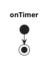

# package_name

## package_name_node

### Input topics

| Name | Type | Description |
| ---- | ---- | ----------- |
|      |      |             |

### Output topics

| Name | Type | Description |
| ---- | ---- | ----------- |
|      |      |             |

### Parameters

| Name | Type | Description |
| ---- | ---- | ----------- |
|      |      |             |

### Output TFs

None

### How to launch

```sh
roslaunch package_name package_name.launch
```

### Flowchart


